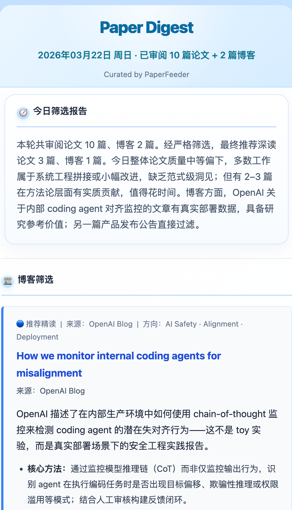
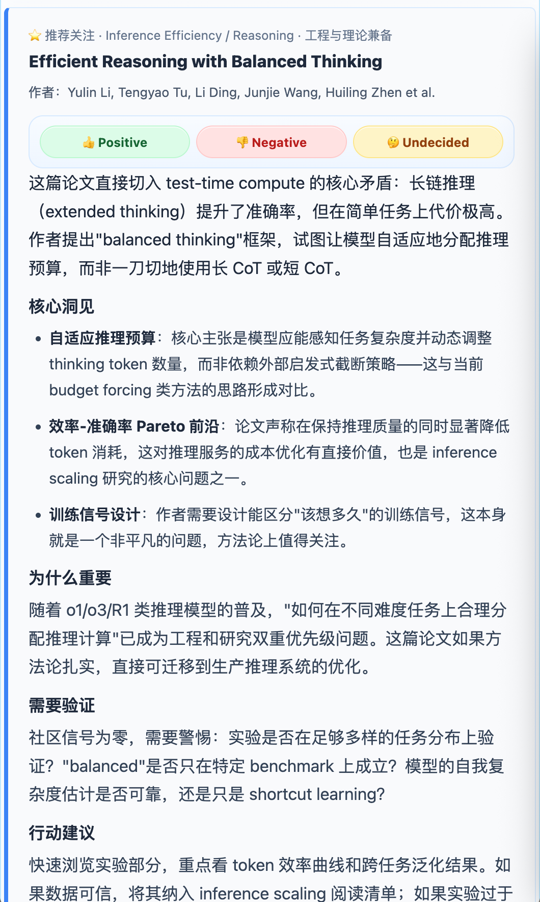
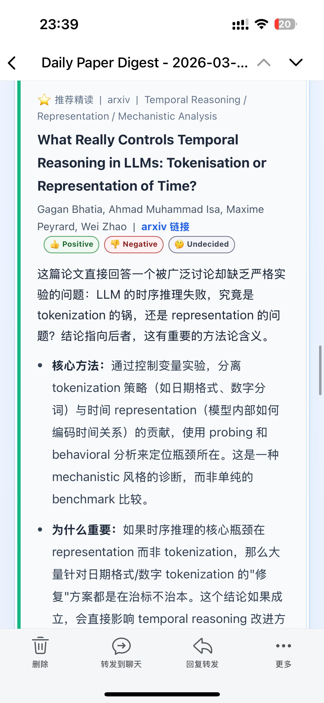
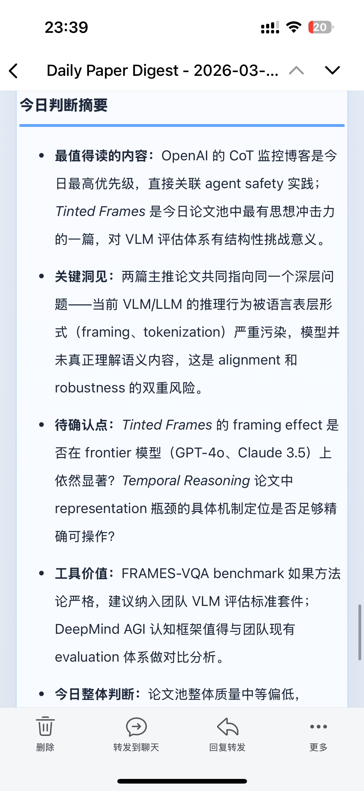
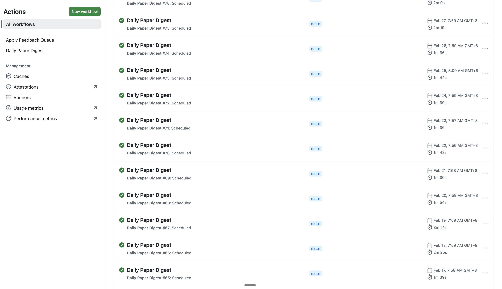

<h1 align="left">
  
  <span style="vertical-align: middle;">PaperFeeder</span>
</h1>

> A daily research intelligence pipeline that triages papers and blogs into a high-signal email digest.

**中文说明：** [README.zh-CN.md](README.zh-CN.md)

## Preview

<table>
  <tr>
    <td align="center"></td>
    <td align="center"></td>
    <td align="center"></td>
    <td align="center"></td>
  </tr>
  <tr>
    <td align="center"><strong>1.</strong> Overview + blog picks</td>
    <td align="center"><strong>2.</strong> Paper detail</td>
    <td align="center"><strong>3.</strong> Paper detail</td>
    <td align="center"><strong>4.</strong> Judgment summary</td>
  </tr>
</table>

<p align="center">
  
</p>

## How It Works

PaperFeeder runs a multi-stage pipeline once per day (or on demand), producing an opinionated HTML digest delivered by email.

### Pipeline Stages

```
Sources → Keyword Filter → Coarse LLM Filter → Enrich → Fine LLM Filter → Synthesize → Email
```

1. **Fetch** — pull from arXiv, Hugging Face Daily Papers, Semantic Scholar recommendations, and curated blogs
2. **Keyword filter** — drop items that don't match your interest keywords or that match exclusion terms
3. **Coarse LLM filter** — batch-score remaining papers by title and abstract using a cheap model
4. **Enrich** — run Tavily web searches to collect implementation notes, community reception, and reproducibility signals
5. **Fine LLM filter** — re-rank the enriched shortlist; decide what enters the final report
6. **Synthesize** — generate an opinionated HTML digest, optionally reading PDF full text for top picks
7. **Deliver** — send by email; optionally publish a web-view copy to Cloudflare D1

### Two-Model Architecture

The pipeline deliberately separates filtering from synthesis so you can use a cheap model for the heavy lifting and a strong model only for the final report:

| Role | Env vars | Recommended model |
|------|----------|-------------------|
| Coarse + fine filtering | `LLM_FILTER_*` | cheap model (e.g. DeepSeek) |
| Final digest writing | `LLM_*` | strong model (e.g. Claude, Gemini, GPT-4o) |

If `LLM_FILTER_*` is not set, the synthesis model handles filtering too.

### State Model

| State | Location | Purpose |
|-------|----------|---------|
| Short-term memory | Cloudflare D1 + `state/semantic/memory.json` | D1 is the remote source of truth; local JSON is an editable/exportable mirror |
| Long-term preferences | Cloudflare D1 + `state/semantic/seeds.json` | D1 is the remote source of truth; local JSON is an editable/exportable mirror |
| Per-run artifacts | `artifacts/` | feedback manifests and review templates per run |
| Remote feedback queue | Cloudflare D1 | stores pending 👍/👎 events before applying to seeds |

The two state files serve different purposes:
- `memory.json` — "already shown recently, skip for now"
- `seeds.json` — "recommend more/less of this kind of paper going forward"

Operationally, D1 is the shared remote state. Local files are working copies that you export, edit, import, or reset on demand.

### Feedback Loop

```
Daily digest → reader clicks 👍/👎 in email or web viewer
→ Cloudflare Worker stores event in D1
→ apply-feedback-queue.yml merges events into D1-backed seeds state
→ future Semantic Scholar recommendations shift accordingly
```

## Repository Structure

```
PaperFeeder/
├── paperfeeder/           # Main Python package
│   ├── pipeline/          # Pipeline stages (runner, filters, researcher, summarizer)
│   ├── sources/           # Paper and blog fetchers (arXiv, HF, Semantic Scholar, RSS)
│   ├── semantic/          # Memory store, feedback export, link signing
│   ├── cli/               # CLI commands (apply_feedback, export_state, import_state, reset_memory)
│   ├── config/            # Config loading and schema
│   ├── chat.py            # OpenAI-compatible LLM client
│   └── email.py           # Email backends (Resend, SendGrid, file, console)
├── cloudflare/            # Cloudflare Worker source and D1 schema
├── scripts/               # Bootstrap and feedback helper scripts
├── state/semantic/        # Runtime state (memory.json, seeds.json)
├── artifacts/             # Per-run feedback manifests and templates
├── user/                  # User-editable profiles, keywords, blogs, prompt addons
├── config.yaml            # Main configuration file
└── main.py                # Digest entrypoint
```

Key modules:

| File | Purpose |
|------|---------|
| `paperfeeder/pipeline/runner.py` | Orchestrates the full pipeline |
| `paperfeeder/pipeline/filters.py` | Keyword filter and two-stage LLM filtering |
| `paperfeeder/pipeline/researcher.py` | Tavily-based external signal enrichment |
| `paperfeeder/pipeline/summarizer.py` | LLM digest generation and HTML wrapping |
| `paperfeeder/semantic/memory.py` | Anti-repetition memory store |
| `paperfeeder/cli/apply_feedback.py` | Apply offline, queued, or D1 feedback to seeds |
| `cloudflare/feedback_worker.js` | Feedback capture and web viewer endpoint |

## Local Setup

### Prerequisites

| Component | Required | Notes |
|-----------|----------|-------|
| LLM API | Yes | any OpenAI-compatible endpoint |
| Email provider | For real use | Resend is the default; local dry-run saves to file |
| Tavily API | Recommended | external signal enrichment |
| Semantic Scholar API key | Recommended | better ID resolution and recommendation quality |
| Cloudflare Worker + D1 | Optional | one-click feedback loop |

### Install

```bash
bash scripts/bootstrap.sh
source .venv/bin/activate
```

Then:

1. Copy `.env.example` to `.env` and fill in credentials
2. Edit `config.yaml` for toggles, limits, and model settings
3. Edit `user/` files for your research interests, keywords, and blog sources

Local `.env` is for local development only. For GitHub Actions, use Repository Secrets and Variables instead.

### User-Editable Files

| File | Controls |
|------|----------|
| `config.yaml` | all runtime toggles, fetch windows, model options, state paths |
| `user/research_interests.txt` | researcher persona fed into LLM prompts |
| `user/keywords.txt` | positive match keywords (title/abstract) |
| `user/exclude_keywords.txt` | topics to suppress |
| `user/arxiv_categories.txt` | arXiv categories to monitor |
| `user/blogs.yaml` | enabled blog sources and custom RSS feeds |
| `user/prompt_addon.txt` | extra instructions injected into LLM prompts |

Preset profiles are available under `user/examples/profiles/`.

### Run Commands

```bash
# Standard runs
python main.py --dry-run          # run pipeline, save report to file (no email)
python main.py --days 3           # run with a 3-day lookback window

# Debug modes (skip fetch / filter / enrich to iterate on prompts faster)
python main.py --debug-sample --dry-run              # load fixture, skip all live stages
python main.py --debug-sample --debug-llm-report     # fixture + call LLM for report
python main.py --debug-minimal-report --dry-run      # fetch real papers, use stub report
```

Add `--debug-write-memory` to any debug run to also update `state/semantic/memory.json`.

Apply feedback to seeds:

```bash
# From a local manifest file
python -m paperfeeder.cli.apply_feedback \
  --manifest-file artifacts/run_feedback_manifest_<run_id>.json --dry-run

# From Cloudflare D1 (all pending events)
python -m paperfeeder.cli.apply_feedback \
  --from-d1 --manifests-dir artifacts --dry-run
```

Manage D1-backed semantic state locally:

```bash
# Pull the latest remote state into local JSON mirrors
./scripts/export-state

# Edit long-term recommendation seeds locally
./scripts/edit-seeds

# Push local JSON mirrors back into D1
./scripts/import-state

# Clear short-term memory locally and in D1
./scripts/reset-memory --yes
```

Equivalent Python modules are also available if you prefer explicit entrypoints:

```bash
python -m paperfeeder.cli.export_state
python -m paperfeeder.cli.edit_seeds
python -m paperfeeder.cli.import_state
python -m paperfeeder.cli.reset_memory --yes
```

Recommended workflow:

1. Run `./scripts/export-state` before inspecting or editing semantic state.
2. Use `./scripts/edit-seeds` to open `state/semantic/seeds.json` locally.
3. Run `./scripts/import-state --only seeds` after editing seeds.
4. Run `./scripts/reset-memory --yes` when you want a clean short-term memory window.

Reset local runtime state:

```bash
python -m paperfeeder.cli.reset_runtime_state --yes              # clear memory.json + local queue
python -m paperfeeder.cli.reset_runtime_state --yes --with-seeds # also clear seeds.json
python -m paperfeeder.cli.reset_runtime_state --yes --skip-queue # memory only
```

## GitHub Actions Deployment

Two workflows handle remote operation:

| Workflow | Schedule (UTC) | Beijing time | Purpose |
|----------|---------------|--------------|---------|
| `daily-digest.yml` | `1 0 * * *` | 08:01 daily | run pipeline, send email, update memory |
| `apply-feedback-queue.yml` | `30 16 */3 * *` | 00:30, every 3 days | merge D1 feedback into seeds |

### Secrets and Variables

All secrets go under **Settings → Secrets and variables → Actions → Repository secrets**.

> **Important:** Secrets must be Repository secrets, not Environment secrets, unless the workflow explicitly declares `environment:`. If secrets appear empty in workflow logs, this is the most common cause.

**Minimum for daily email delivery:**

| Secret | Purpose |
|--------|---------|
| `LLM_API_KEY` | synthesis model API key |
| `LLM_MODEL` | synthesis model name |
| `RESEND_API_KEY` | email delivery |
| `EMAIL_TO` | recipient address |

**Recommended additions:**

| Secret | Purpose |
|--------|---------|
| `LLM_BASE_URL` | base URL if using a non-OpenAI endpoint |
| `LLM_FILTER_API_KEY` | separate cheap model for filtering |
| `LLM_FILTER_BASE_URL` | base URL for the filter model |
| `LLM_FILTER_MODEL` | model name for filtering |
| `TAVILY_API_KEY` | external signal enrichment |
| `SEMANTIC_SCHOLAR_API_KEY` | better recommendation quality |

**For the full feedback loop:**

| Secret | Purpose |
|--------|---------|
| `CLOUDFLARE_ACCOUNT_ID` | Cloudflare account |
| `CLOUDFLARE_API_TOKEN` | Cloudflare API token |
| `D1_DATABASE_ID` | D1 database for feedback events |
| `FEEDBACK_ENDPOINT_BASE_URL` | Worker URL embedded in feedback links |
| `FEEDBACK_LINK_SIGNING_SECRET` | HMAC key for signed feedback tokens |

**Optional Variables** (Settings → Secrets and variables → Actions → Repository variables):

| Variable | Default | Purpose |
|----------|---------|---------|
| `SEMANTIC_STATE_BACKEND` | `d1` | semantic state backend (`d1` or `file`) |
| `SEMANTIC_MEMORY_ENABLED` | `true` | enable/disable anti-repetition memory |
| `SEMANTIC_SEEN_TTL_DAYS` | `30` | how long seen papers are suppressed |
| `SEMANTIC_MEMORY_MAX_IDS` | `5000` | cap on memory store size |
| `FEEDBACK_TOKEN_TTL_DAYS` | — | expiry for signed feedback links |
| `FEEDBACK_REVIEWER` | — | reviewer ID stamped on feedback events |

### Remote Semantic State

Workflows never write runtime state back to `main`. Instead:

- `daily-digest.yml` exports semantic state from D1 before the run and re-imports updated `memory.json` after the run
- `apply-feedback-queue.yml` exports seeds from D1 before applying feedback and re-imports updated `seeds.json` after the run

That keeps Git history clean while still letting humans inspect and edit local JSON copies when needed.

### First Deployment Checklist

1. Push repo to GitHub, enable Actions
2. Add all required secrets under **Repository secrets** (not under an Environment)
3. Set optional Variables as needed
4. Manually trigger **Daily Paper Digest** with `dry_run=true` — inspect logs and artifacts
5. Run once with `dry_run=false` — confirm email arrives and D1-backed semantic state round-trips cleanly
6. *(Full feedback loop only)* Deploy the Cloudflare Worker, then verify `apply-feedback-queue.yml` runs cleanly

### Cost Estimate

Running once per day, ~40–60 raw candidates, ~10–25 entering LLM filtering, ~6–10 in the final shortlist:

| Setup | Model split | Rough monthly cost |
|-------|-------------|-------------------|
| Budget | DeepSeek (filter) + Gemini Flash (synthesis) | ~$2–8 |
| Balanced | DeepSeek (filter) + Claude Sonnet / Gemini Pro (synthesis) | ~$8–25 |
| Heavy | Strong model throughout, larger shortlist, more PDFs | ~$20–50 |

The dominant cost is the synthesis step, which only processes the final shortlist. Routing filtering to a cheap model keeps overall spend low regardless of ingest volume.

## Notes

- `artifacts/` and `llm_filter_debug/` are disposable runtime outputs; safe to delete.
- `state/semantic/` holds live runtime state; don't delete unless intentionally resetting.
- On GitHub Actions, `memory.json` and `seeds.json` live on the state branch, not on `main`.

